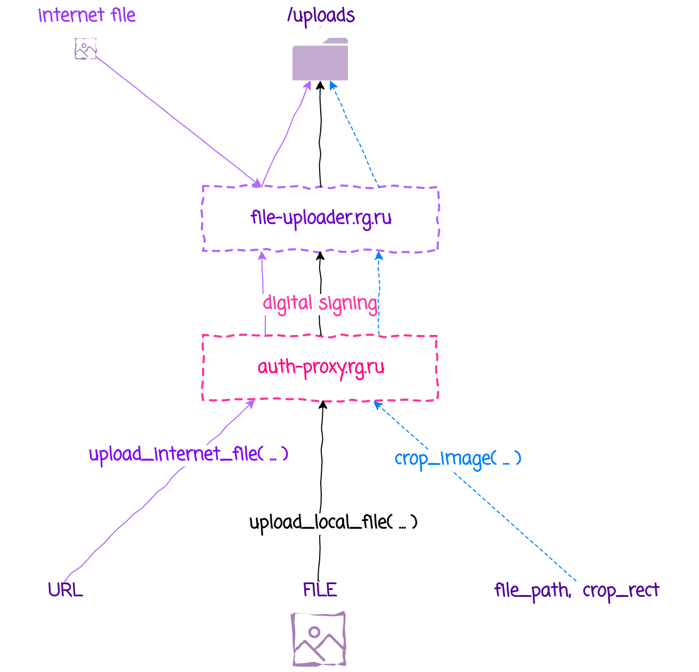

# File Uploader

## Микросервис загрузки файлов, и обрезки загруженных изображений





Загруженные файлы сохраняются в директории указанной в  `configs/img.yaml`.
Файлы сохраняются в поддиректориях вида:

    YYYY/MM/DD/RANDOM_NUMBER/

Изображения ширина которых превышает  `max_image_width` px (указанной в img.yaml) пропорционально ужимаются до ширины `max_image_width` px.

## Проверка цифровой подписи запросов на загрузку изображений

Для контроля откуда поступают запросы на загрузку изображений, программа проверяет цифровые подписи запросов. Проверка подписи  происходит 
<br>**если**
1. в файле `configs/signature.yaml` проставлены поля: 

    ```
    public_key_file: ./certificates/auth-proxy.key.pub
    keyid: auth-proxy
    ```
    и 

2. файл с публичным ключом присутствует на диске. 

**В противном случае** проверка подписи не производится.

Публичный ключ `auth-proxy` находится здесь 
<https://auth-proxy.rg.ru/publickey>


## GraphQL

Конечные точки GraphQL 
- `/schema` 
- `/graphql`


Методы загрузки файлов:
- `upload_local_file (file_field_name)` для загрузки локальных файлов
- `upload_internet_file (file_url)` для загрузки файлов из интернет

Оба метода возвращают 

    {
        filepath        путь к сохраненному файлу 
        width           ширина сохраненного изображения px
        height          высота сохраненного изображения px
        size            размер сохраненного файла bytes
        initial_size    размер загруженного файла bytes
    }

## REST

Загруженные файлы доступны по URL 
https://image-loader.rg.ru/uploads + `filepath`. 
<br>Где `filepath` - то, что вернул метод загрузки/обрезки изображения.


### Запуск для разработчика

    go run main.go -serve 5500 -env=dev

### Сборка контейнеров для фронтэнд разработчиков

    sh/build-frontend-container.sh

### Пуш и запуск деплоя на https://git.rgwork.ru

    sh/push.sh
    sh/deploy.sh


### Полное обновление программы
полное обновление программы состоит из следующих этапов

1. Сборка контейнеров для фронтэнда
2. Выгрузка изменений в репозиторий
3. Запуск деплоя https://git.rgwork.ru

```sh
git add git add -A .
git commit -m "fix: description"

sh/build-frontend-container.sh
sh/push.sh
sh/deploy.sh
```

